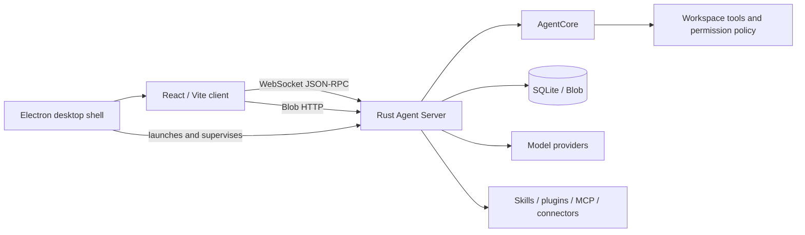

<div align="center">

# Eden Agent

**A local-first, persistent, embeddable agent runtime written in Rust**

React / Vite client · Electron desktop app · WebSocket JSON-RPC · SQLite

[](https://github.com/jiang357357357/EdenAgent/actions/workflows/ci.yml)


[简体中文](README.md) · **English**

</div>

> [!IMPORTANT]
> Eden Agent is under active development, and its protocols and configuration formats may still change. The current source is available for noncommercial use under PolyForm Noncommercial 1.0.0. This is not an OSI-approved open-source license; commercial use requires a separate license.

## Overview

Eden Agent runs the agent loop, tool execution, persistence, and desktop experience locally. The Rust Server is the only backend process. The frontend talks to it exclusively through a generated WebSocket JSON-RPC client and Blob endpoints—there is no Python sidecar or legacy native bridge.

### Capabilities

| Area | Features |
| --- | --- |
| Agent runtime | Streaming conversations, context management, compaction, tool loops, and session recovery |
| Local workspace | File browsing and editing, controlled command execution, and workspace switching |
| Model services | OpenAI, DeepSeek, Ollama, and custom OpenAI-compatible services |
| Character experience | Full character profiles, static art, Spine animation, GSV speech synthesis, and transcription settings |
| Extensibility | Skills, plugins, multi-agent orchestration, scheduled jobs, MCP, and connectors |
| Data and security | SQLite persistence, capability tokens, permission approval, fail-closed sandboxing, and Blob storage |
| Official connectors | Hearts of Iron IV, Victoria 3, OpenTTD, and Lichess |

## Architecture



The Server persists events before broadcasting them. `AgentCore` remains host-independent and has no dependency on HTTP, SQLite, Electron, or a specific model provider.

## Repository layout

| Path | Purpose |
| --- | --- |
| [`AgentCore`](AgentCore) | Host-independent Rust library crates for domain types, the agent loop, context, and tool execution |
| [`Server`](https://github.com/jiang357357357/EdenAgentServer) | Rust host-service submodule for protocol, storage, models, permissions, and extensions |
| [`frontend`](https://github.com/jiang357357357/EdenAgentFrontend) | React/Vite client and Electron desktop-shell submodule |
| [`Connectors`](Connectors) | Official installable connectors and workers |
| [`Script`](Script) | Development launchers, configuration readers, packaging, and migration tools |
| [`文档`](文档) | Design notes, runbooks, and acceptance material |

## Quick start

### Requirements

- Rust 1.85 or newer
- Node.js 22 or newer
- npm
- A Linux or Windows desktop environment

### Clone and run

```bash
git clone --recurse-submodules https://github.com/jiang357357357/EdenAgent.git
cd EdenAgent
npm ci
npm --prefix frontend ci
cp .monconfig.example .monconfig
npm run dev
```

Default endpoints:

- Web client: `http://127.0.0.1:40091`
- Rust Server: `http://127.0.0.1:40092`
- Health check: `http://127.0.0.1:40092/readyz`

After the desktop app starts, open **Configuration → Model Service** to set the model name, API endpoint, and key. Credentials should remain local—never commit `.monconfig`, runtime configuration, or logs.

### Run individual components

| Command | Purpose |
| --- | --- |
| `npm run dev` | Start the Web client, Electron, and Rust Server |
| `npm run dev:server` | Start only the Rust Server |
| `npm run dev:web` | Start only the Web client |
| `npm run dev:desktop` | Start the desktop development environment |
| `npm run generate:rpc` | Regenerate the TypeScript RPC client from Rust API types |

## Character and visual assets

Character binaries are intentionally excluded from the source repositories. Keep static artwork and Spine exports in a separate local `AgentAssets` repository, then import them from **Configuration → Character Configuration → Visual Resources**.

To migrate existing local asset paths:

```bash
node Script/Project/MigrateCharacterAssets.mjs ../AgentAssets
```

Do not publish an asset repository until the origin and redistribution rights of every file have been verified. Third-party character, Spine, voice, model, game, and trademark materials are not covered by the Eden Agent software license.

## Development and verification

```bash
# Rust
cargo fmt --all --check
cargo clippy --workspace --all-targets --locked -- -D warnings
cargo test --workspace --locked

# Frontend
npm --prefix frontend/web run typecheck
npm --prefix frontend/web test
npm --prefix frontend/desktop test
```

GitHub Actions runs the same core checks on every push and pull request.

## Security principles

- The Server binds to `127.0.0.1` by default.
- The renderer connects with a short-lived capability token.
- File writes, command execution, and external communication go through the permission policy.
- Command tools are registered only when an OS sandbox is available; otherwise they fail closed.
- Events are persisted before they are broadcast to clients.

Read [SECURITY.md](SECURITY.md) before reporting a security issue. Do not disclose credentials or vulnerability details in a public Issue.

## Documentation

- [Contributing](CONTRIBUTING.md)
- [Security policy](SECURITY.md)
- [Changelog](CHANGELOG.md)
- [Licensing guide](LICENSING.md)
- [Third-party notices](THIRD-PARTY-NOTICES.md)
- [Technical documentation](文档)

## License

Current versions are source-available for noncommercial use under the [PolyForm Noncommercial License 1.0.0](LICENSE). Commercial use requires a [separate written commercial license](COMMERCIAL-LICENSE.md). See [LICENSING.md](LICENSING.md) for the transition and historical-version scope.

---

<div align="center">

If Eden Agent is useful to you, consider starring the repository, opening an Issue, or contributing an improvement.

</div>
