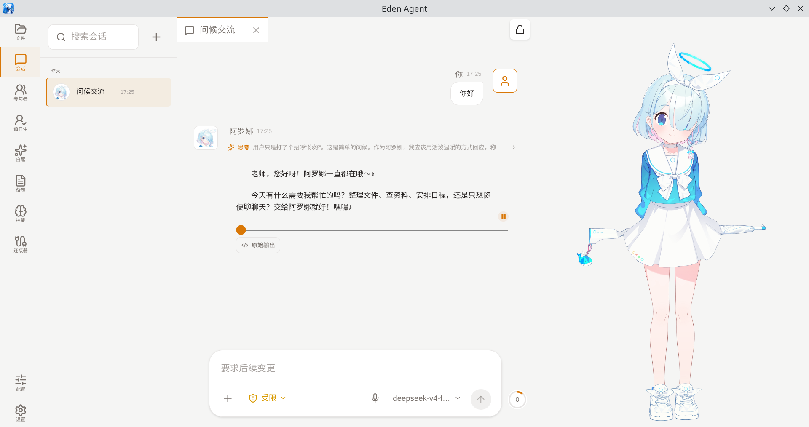
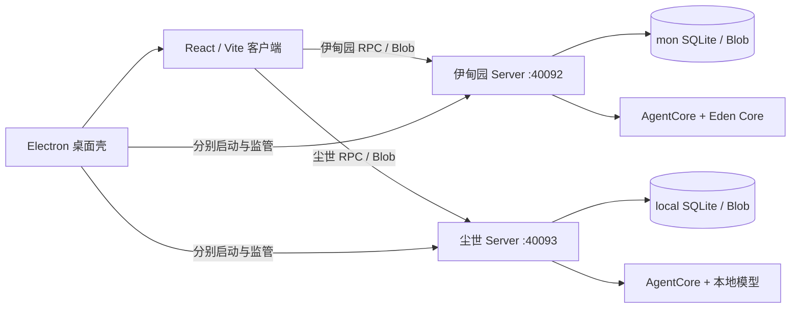

<div align="center">

# Eden Agent

**本地优先、可持久化、可嵌入的 Rust 智能体运行时**

React / Vite 客户端 · Electron 桌面端 · WebSocket JSON-RPC · SQLite

[](https://github.com/jiang357357357/EdenAgent/actions/workflows/ci.yml)


**简体中文** · [English](README.en.md)

</div>

> “要用皂荚木作一柜。”<br>
> “我要在那里与你相会。”
>
> ——《出埃及记》25:10、25:22（和合本）

Eden Agent 的设计灵感来自《蔚蓝档案》中的“什亭之匣”。这是一个独立的源代码公开项目，与原作及其官方无关联。

<p align="center">
  
</p>

> [!IMPORTANT]
> Eden Agent 正在持续开发，协议与配置格式仍可能变化。当前代码以 PolyForm Noncommercial 1.0.0 提供非商业使用，并非 OSI 定义的开源许可证；商业使用需要单独授权。

## 项目简介

Eden Agent 把智能体循环、工具调用、持久化和桌面体验放在本地运行。桌面端分别监管伊甸园与尘世两个 Rust Server；前端只通过生成的 WebSocket JSON-RPC 客户端和 Blob 端点访问当前世界，不依赖 Python sidecar 或旧原生桥接层。

### 核心能力

| 方向 | 能力 |
| --- | --- |
| 智能体运行时 | 流式对话、上下文管理、压缩、工具循环、会话恢复 |
| 本地工作区 | 文件浏览与编辑、受控命令执行、工作区切换 |
| 模型服务 | OpenAI、DeepSeek、Ollama 与自定义 OpenAI 兼容服务 |
| 角色体验 | 完整角色资料、静态立绘、Spine 立绘、GSV 语音合成与语音转录配置 |
| 扩展系统 | 技能、插件、多智能体、定时作业、MCP 与连接器 |
| 数据与安全 | SQLite 持久化、能力令牌、权限审批、沙箱故障关闭、Blob 存储 |
| 官方连接器 | Hearts of Iron IV、Victoria 3、OpenTTD、Lichess |

## 架构



两个世界使用不同端口、能力令牌、SQLite、Blob、日志、插件、用户技能、子智能体与连接器目录，进程也不共享模型凭据。尘世模型密钥仅保存在 `Data/realms/local/local-runtime.json`。数据库首次绑定世界后不可被另一世界打开。事件由对应 Server 先持久化再广播。`AgentCore` 保持宿主无关，不依赖 HTTP、SQLite、Electron 或具体模型供应商。

## 仓库结构

| 路径 | 说明 |
| --- | --- |
| [`AgentCore`](AgentCore) | 宿主无关的 Rust library crates，包含领域类型、智能体循环、上下文与工具执行 |
| [`Server`](https://github.com/jiang357357357/EdenAgentServer) | Rust 宿主服务子模块，负责协议、存储、模型、权限及扩展系统 |
| [`frontend`](https://github.com/jiang357357357/EdenAgentFrontend) | React/Vite 客户端与 Electron 桌面壳子模块 |
| [`Connectors`](Connectors) | 官方可安装连接器及其 worker |
| [`Script`](Script) | 开发启动、配置读取、打包与迁移工具 |
| [`文档`](文档) | 设计说明、运行手册与验收资料 |

## 快速开始

### 环境要求

- Rust 1.85 或更高版本
- Node.js 22 或更高版本
- npm
- Linux 或 Windows 桌面环境

### 获取并启动

```bash
git clone --recurse-submodules https://github.com/jiang357357357/EdenAgent.git
cd EdenAgent
npm ci
npm --prefix frontend ci
cp .monconfig.example .monconfig
npm run dev
```

默认端口：

- Web 客户端：`http://127.0.0.1:40091`
- 伊甸园 Server：`http://127.0.0.1:40092`
- 尘世 Server：`http://127.0.0.1:40093`
- 健康检查：`http://127.0.0.1:40092/readyz`、`http://127.0.0.1:40093/readyz`

启动桌面端后，可在 **配置 → 模型服务** 中填写模型名称、API 地址与密钥。密钥只应保存在本机，不要提交 `.monconfig`、运行时配置或日志。

### 分组件运行

| 命令 | 用途 |
| --- | --- |
| `npm run dev` | 启动 Web、Electron 与两个隔离的 Rust Server |
| `npm run dev:server` | 安全启动一个 Rust Server；默认伊甸园，可用 `EDEN_AGENT_RUNTIME_ORIGIN=local` 选择尘世 |
| `npm run dev:web` | 只启动 Web 客户端 |
| `npm run dev:desktop` | 启动桌面开发环境 |
| `npm run generate:rpc` | 从 Rust API 类型重新生成 TypeScript RPC 客户端 |

## 角色与视觉资源

角色二进制资源不会随代码仓库分发。请将静态图片与 Spine 导出文件放在独立的本地 `AgentAssets` 仓库中，再从 **配置 → 角色配置 → 视觉资源** 导入。

迁移已有本地资源路径：

```bash
node Script/Project/MigrateCharacterAssets.mjs ../AgentAssets
```

在确认每个文件的来源及再分发权之前，请勿公开资源仓库。第三方角色、Spine、语音、模型、游戏内容和商标不在 Eden Agent 软件许可证的授权范围内。

## 开发与验证

```bash
# Rust
cargo fmt --all --check
cargo clippy --workspace --all-targets --locked -- -D warnings
cargo test --workspace --locked

# Frontend
npm --prefix frontend/web run typecheck
npm --prefix frontend/web test
npm --prefix frontend/desktop test
```

GitHub Actions 会在每次推送和拉取请求中执行同样的核心检查。

## 安全原则

- Server 默认只监听 `127.0.0.1`。
- 两个世界使用不同的本地进程、端口、能力令牌与持久化目录。
- 渲染进程只使用当前世界的短期能力令牌连接对应服务。
- 写文件、执行命令、外部通信等副作用必须经过权限策略。
- 命令工具只有在可用的操作系统沙箱中才注册；缺少沙箱时保持关闭。
- 事件先持久化，再向客户端广播。

发现安全问题请阅读 [SECURITY.md](SECURITY.md)，不要通过公开 Issue 披露密钥或漏洞细节。

## 文档

- [贡献指南](CONTRIBUTING.md)
- [安全策略](SECURITY.md)
- [版本记录](CHANGELOG.md)
- [授权说明](LICENSING.md)
- [第三方声明](THIRD-PARTY-NOTICES.md)
- [技术文档目录](文档)

## 许可证

当前版本依据 [PolyForm Noncommercial License 1.0.0](LICENSE) 提供非商业源码使用。商业使用必须取得[单独书面商业授权](COMMERCIAL-LICENSE.md)。许可证迁移和历史版本适用范围见 [LICENSING.md](LICENSING.md)。

---

<div align="center">

如果 Eden Agent 对你有帮助，欢迎 Star、提交 Issue 或参与改进。

</div>
